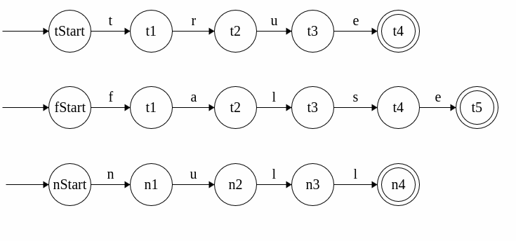
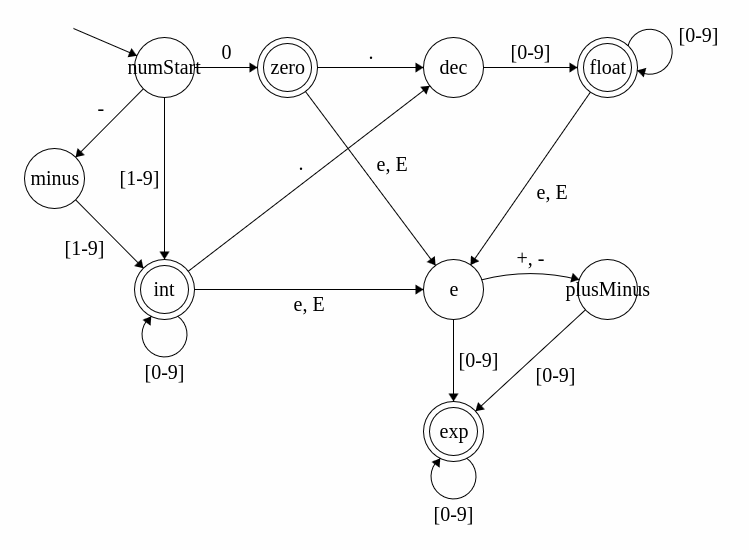
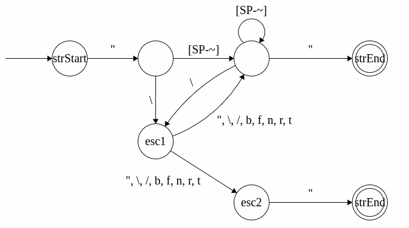
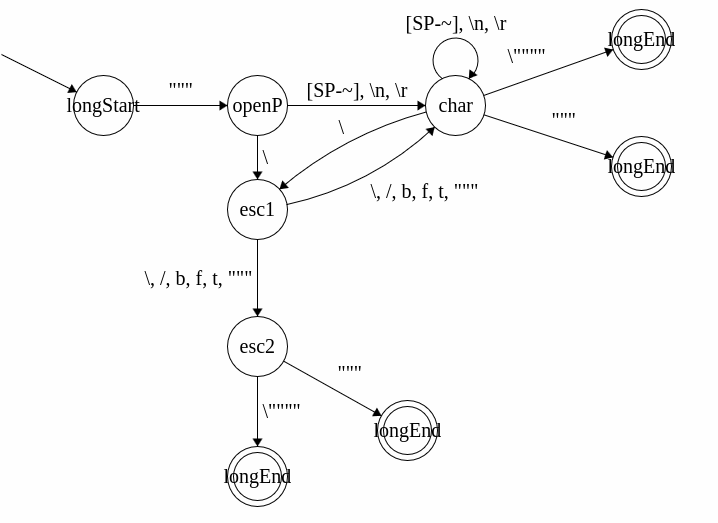
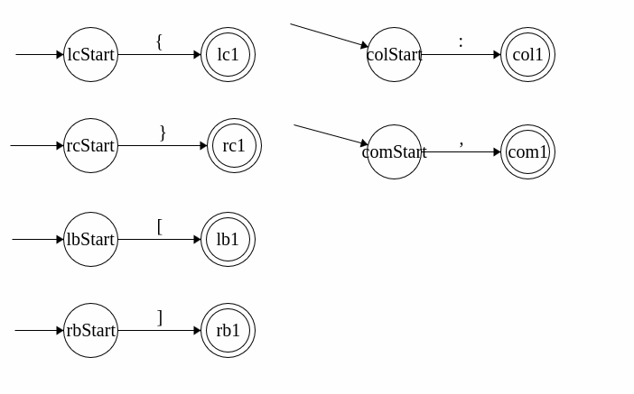
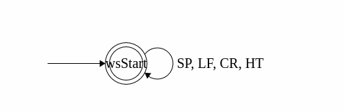
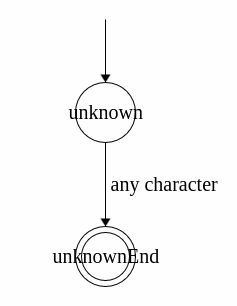

## True, False, and Null
Each DFA only recognizes their respective words and no other characters.

## Number
This DFA only recognizes integers, floats, and exponents (all positive or negative) in JSON format.

## String
This DFA recognizes only JSON formatted strings, except Unicode code points. [SP-~] denotes only the ASCII characters between (ASCII 32) and ~ (126), except for " or \ (which have their own transitions to keep the structure of a DFA).

## Long String
This DFA recognizes only long strings. [SP-~] denotes only the ASCII characters between (ASCII 32) and ~ (126), except for \ (which has its own transition to keep the structure of a DFA).

## Single Characters
These DFAs simply accept their respective single character input.

## Whitespace
Accepts only valid whitespaces as inputs.

## Unknown
May take any character to match input in case of failure of other DFAs.

