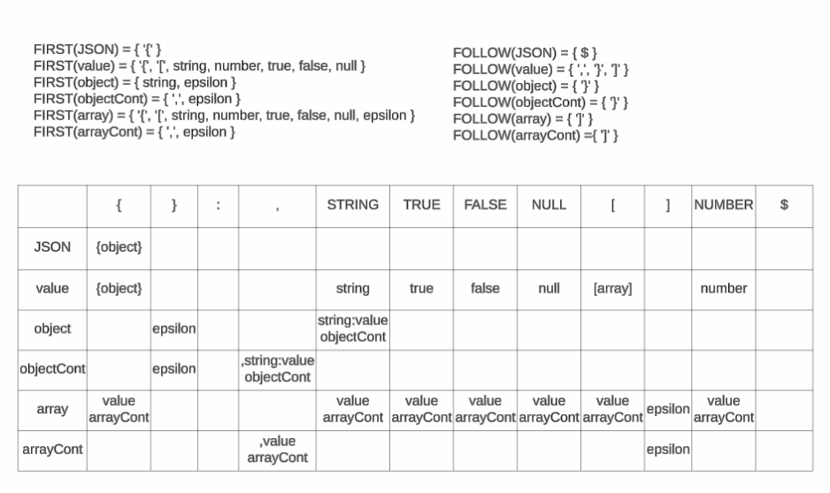

## JSON Grammar

<!-- ```
object -> '{' (string ':' value (',' string ':' value)*)? '}'

value -> string | number | object | array | 'true' | 'false' | 'null'

string -> '"' ([^"\] | \["\/bfnrt])* '"'

array -> '[' (value (',' value)*) ']'

number -> ('0' | '-'? [1-9] [0-9]*) ([Ee] [+-]? [0-9]+)?
        | ('0' | '-'? [1-9] [0-9]*) '.' [0-9]+ ([Ee] [+-]? [0-9]+)?
``` -->

```
JSON -> {object}
value -> {object} | [array] | string | number | 'true' | 'false' | 'null'
object -> string:value objectCont | epsilon
objectCont -> ,string:value objectCont | epsilon
array -> value arrayCont | epsilon
arrayCont -> ,value arrayCont | epsilon
```

## First and Follow sets and LL(1) Parse Table
